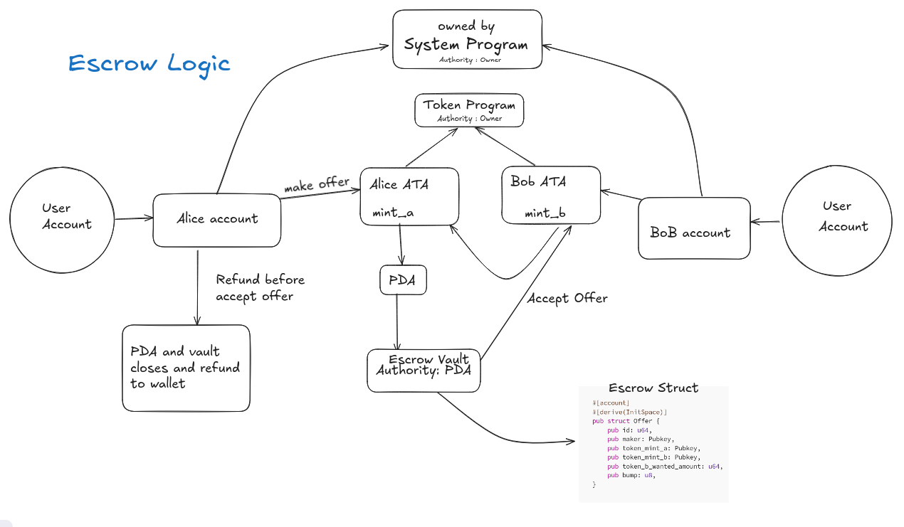

## Escrow Logic Flow

The escrow flow works as follows:

1. **Make Offer** – Alice locks her tokens (Mint A) into a PDA-controlled vault account.  
2. **Accept Offer** – Bob can accept the offer by providing his tokens (Mint B). Once accepted, the PDA vault releases Alice’s tokens to Bob, and Bob’s tokens to Alice.  
3. **Refund Before Accept** – If no one accepts the offer, Alice can cancel it. The PDA closes the vault and refunds Alice’s tokens.  
